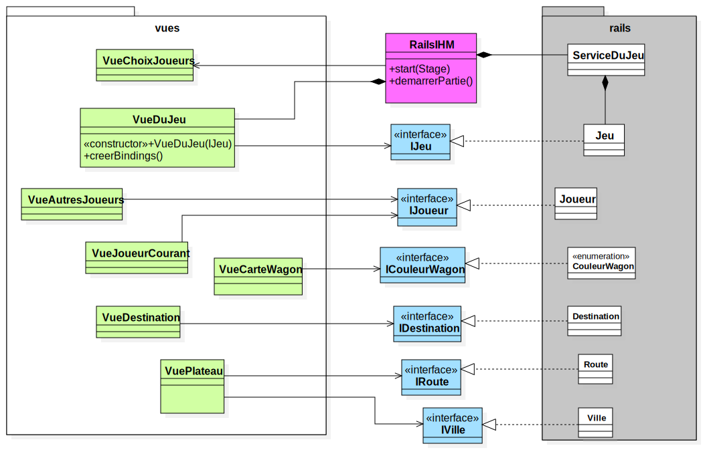

# Projet - _Aventuriers du Rail (Europe)_

## Description

Ce projet a pour but de recréer le jeu de société _Aventuriers du Rail (Europe)_.

Il est développé en Java et utilise la librairie [JavaFX](https://openjfx.io/).

Les règles du jeu sont disponibles [ici](<src/main/resources/Les Aventuriers du Rail - Règles.pdf>).

## Architecture générale du code
